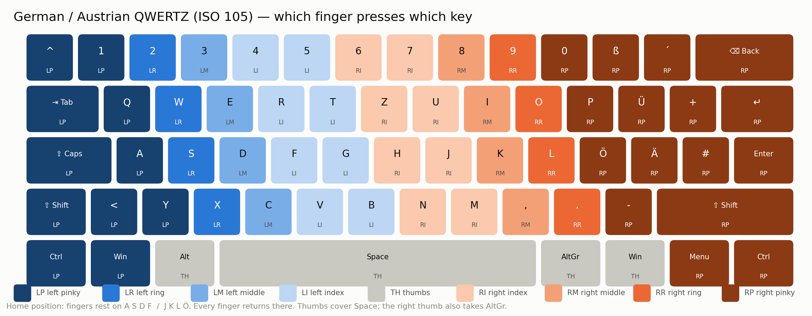
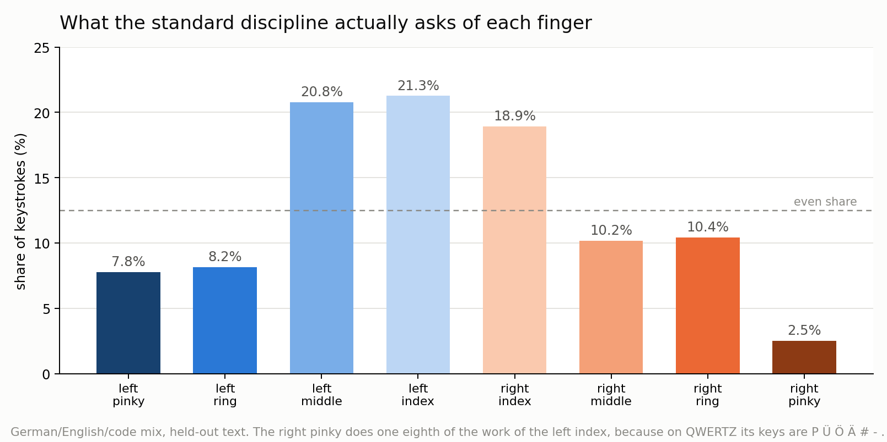

# Which finger should press which key

A measurement study of the **ten-finger typing discipline** for a German/Austrian
QWERTZ keyboard (ISO 105-key, T1). Not a new layout — the letters stay exactly where they
are on the board you already own. The only question is which finger should press each key,
and whether the assignment everyone is taught is actually the efficient one.

**The answer is that it is.** A search over the whole space of physically credible finger
assignments cannot beat the standard German discipline without making your fingers travel
further. There are four habit-level changes worth making, and the biggest of them has
nothing to do with the letters.

---

## The map



Fingers rest on **A S D F** and **J K L Ö**. Every finger returns there after every
keystroke. Thumbs cover Space; the right thumb also takes AltGr.

| finger | rests on | also presses |
|---|---|---|
| **left pinky** | `A` | `^` `1` `Q` `<` `Y` — and Tab, Caps, left Shift, left Ctrl |
| **left ring** | `S` | `2` `W` `X` |
| **left middle** | `D` | `3` `E` `C` |
| **left index** | `F` | `4` `5` `R` `T` `G` `V` `B` |
| **right index** | `J` | `6` `7` `Z` `U` `H` `N` `M` |
| **right middle** | `K` | `8` `I` `,` |
| **right ring** | `L` | `9` `O` `.` |
| **right pinky** | `Ö` | `0` `ß` `´` `P` `Ü` `+` `Ä` `#` `-` — and Enter, Backspace, right Shift |
| **thumbs** | Space | right thumb: AltGr |

---

## Contents

| | |
|---|---|
| [Is the standard assignment right?](#1-is-the-standard-assignment-right) | the main experiment |
| [What it costs you](#2-what-the-standard-assignment-costs-you) | the load distribution nobody mentions |
| [Four changes worth making](#3-four-changes-worth-making) | ranked by measured benefit |
| [The reach table](#4-the-reach-table) | why some keys feel worse than others |
| [docs/METHOD.md](docs/METHOD.md) | how any of this was measured |
| [docs/REPRODUCE.md](docs/REPRODUCE.md) | every command, and what would falsify it |
| [RESULTS.md](RESULTS.md) | all the tables |

---

## How this was tested

Claims about typing efficiency are usually circular: someone invents a cost model, then
reports that their preferred technique scores well on it. So the core measurement here has
no comfort weights in it at all.

**A parallel-finger simulator.** Ten fingers are independent actuators that move
**concurrently** — while your right index is typing, your left middle is already on its way
to its next key. A keystroke is delayed only when the finger it needs is still busy or
still travelling:

```
press[i] = max( press[i-1] + GAP,  free[finger] + travel_time(from, to) )
free[f]  = press[i] + DWELL
travel_time(d) = T_MOVE + SPEED * sqrt(d)     # ballistic: accelerate, then decelerate
```

Everything the usual scoring models put in by hand falls out of this instead. A finger
asked to do two jobs in a row is slow because one actuator must do them in series.
Alternating hands is fast because the travel hides behind the other hand's work. A long
reach is free when the finger had idle time to prepare and expensive when it did not.

Three parameters, all physical, all in units of time. Rather than choose values, the
analysis sweeps 36 combinations and checks whether the ranking ever changes.

Alongside it, two measures with **no parameters at all**: how many millimetres your fingers
actually travel per character, and how the keystrokes are distributed across the eight
fingers. Neither can be tuned to favour anything.

Geometry is the real ISO board in millimetres — 19.05 mm pitch, with the true row stagger
(Tab 1.5u, Caps 1.75u, LShift 1.25u), so the awkwardness of `B` and `Z` is measured rather
than asserted. Text is 1.1M characters of held-out German, 1.9M of English and 3.4M of
Python, none of which the search saw.

---

## 1. Is the standard assignment right?

An assignment is fully described by where the boundaries between fingers fall in each row,
since fingers are ordered left-to-right and hands do not cross:

```
LP | LR | LM | LI | RI | RM | RR | RP        7 boundaries per row, 3 letter rows
```

That is a 21-integer search space, small enough to search thoroughly. Resting positions
follow the assignment rather than being pinned to ASDF/JKLÖ: each finger rests on the
home-row key it owns that is nearest its anatomical column.

**Optimising for speed alone finds a 3.2% improvement — and it is not real:**

| | simulated time | finger travel | weak-finger load |
|---|---|---|---|
| standard German discipline | 48.594 ms/char | **31.29 mm/char** | **28.9%** |
| best assignment, speed only | **47.026 ms/char** (−3.2%) | 43.12 mm/char (**+38%**) | 53.6% |
| best, with load capped at standard's | 47.456 ms/char (−2.3%) | 41.32 mm/char (**+32%**) | 27.9% |

It buys its time by sending fingers on longer journeys that happen to be hidden behind the
other hand's work. Your fingers move a third further; the simulated clock is slightly
faster. That is not a technique anyone should adopt.

**So the decisive test is whether anything beats the standard on time while spending no more
travel and no more load on the weak fingers.** Caps are set to the standard discipline's own
values, so nothing is traded against anything:

| | simulated time | finger travel | weak-finger load |
|---|---|---|---|
| standard | 48.594 ms/char | 31.29 mm/char | 28.9% |
| best found inside the box | 47.925 ms/char | 31.64 mm/char — **over the cap** | 28.9% |

**No improvement.** The best candidate is 1.4% faster and spends 1.1% more travel; it sits
just outside the box rather than inside it. The standard German ten-finger assignment is on
the efficiency frontier for the keys as they actually sit.

That is a boring answer and it is the one the measurements give. It also means the useful
question is not *which assignment* but *which individual keys* — and there the answer is
almost as short. Of eleven single-key reassignments tested, exactly one improves anything:

| key | from | to | reach now | reach after | Δ time | Δ travel | verdict |
|---|---|---|---|---|---|---|---|
| `Y` | left pinky | left ring | 21.3 mm | 21.3 mm | −0.006 | ±0.00 | **keep** |
| `Z` | right index | left index | 30.5 mm | 38.4 mm | −0.034 | +0.09 | no |
| `6` | right index | left index | 50.6 mm | 44.9 mm | ±0.000 | ±0.00 | geometry only |
| `B` | left index | right index | 34.3 mm | 34.3 mm | +0.045 | ±0.00 | no |
| `M` | right index | right middle | 21.3 mm | 21.3 mm | +0.107 | ±0.00 | no |
| `H` | right index | right middle | 19.0 mm | 38.1 mm | +0.139 | +1.66 | no |
| `G` | left index | left middle | 19.0 mm | 38.1 mm | +0.262 | +0.89 | no |
| `T` | left index | left middle | 23.8 mm | 38.4 mm | +0.475 | +2.13 | no |

The inward stretches everyone complains about — `G`, `H`, `T`, `B` — are all correctly
assigned. Handing them to the neighbouring finger makes things worse, because that finger
would have to cross the board to reach them.

## 2. What the standard assignment costs you



The assignment is efficient; the *distribution* is wildly uneven, and that is a property of
QWERTZ rather than of the discipline.

**Your right pinky does one eighth of the work your left index does.** Its keys are
`P Ü Ö Ä # -` — all rare in German and English. Meanwhile the left middle and index fingers
carry 21% each, more than one keystroke in five.

This is worth knowing for two reasons. It is the strongest argument for eventually changing
layout rather than technique — no finger assignment can fix a letter distribution. And it
means that if something starts to hurt, the left hand is the more likely culprit, despite
the right pinky owning the longest reaches on the board.

## 3. Four changes worth making

Ranked by measured benefit. None of them moves a letter.

### 3.1 Use the opposite hand's Shift — every time

The largest single habit change available, and it matters far more in German than in
English because German capitalises every noun.

| corpus | capitals as % of letters |
|---|---|
| German, modern (Wikipedia) | **8.32%** |
| German, 19th century | 5.18% |
| English | 2.59% |

You shift **3.2× as often as an English typist.** And the cost of getting it wrong is large:

| | opposite-hand Shift | same-hand Shift | penalty |
|---|---|---|---|
| cost per capital, QWERTZ | 2.76 | 4.95 | **+79%** |

At German capitalisation rates that is roughly **4% of total typing effort**, for free. If
you press `Shift+A` with your left hand you are pinning the pinky of the hand that then has
to reach. Capital `A` takes the **right** Shift; capital `Ö` takes the **left**.

### 3.2 Put AltGr on your right thumb, not your pinky

AltGr sits right of the space bar and is a **thumb** key. Reaching it with the right pinky,
or twisting the wrist to get there, is the most common bad habit on a German keyboard and
it makes `{ } [ ] \ @ ~ |` — the characters a programmer types constantly — far worse than
they need to be.

For the same reason, `AltGr + 7/8/9/0` for `{ [ ] }` is genuinely awkward even done
correctly: the thumb anchors the right hand while that same hand reaches the number row. If
you write code, the fix is a symbol layer rather than better technique — see
[RESULTS.md §4](RESULTS.md#4-the-symbol-layer), which measures **−39%** on 1.53M symbol
keystrokes from real code.

### 3.3 The ISO angle mod — the one free assignment change

Your board has an extra key left of `Y` that standard technique wastes on nothing. Shifting
the whole left bottom row one position left onto it — pinky takes `<`, ring takes `Y`,
middle takes `X`, index takes `C` and `V` — straightens the left hand's angle.

| | standard | angle mod | change |
|---|---|---|---|
| QWERTZ effort | 2707.7 | 2691.8 | **−0.6%** |
| finger travel | 31292 | 30842 | −1.4% |

It is genuinely free — no letters move, no driver, the key is already there — and it is
genuinely small. It is worth more on QWERTZ than on any optimised layout, because it mainly
rescues `B` at 34.3 mm, and a good layout would not have put a common letter there.

Note the single-key table above found `Y` → left ring as the one beneficial change; the
angle mod is that change plus the geometry gain from moving the whole row.

### 3.4 Stop reaching for Backspace with your pinky

Backspace is **57 mm** from the right pinky's resting key — the longest reach on the entire
board — and it is one of the three most-pressed keys on any keyboard.

| Backspace as % of your keystrokes | effort saved by moving it to a thumb key |
|---|---|
| 2% | 4.4% |
| **5.9%** (trained typists) | **13.0%** |
| **6.5%** (untrained) | **14.3%** |
| 8% | 17.6% |

The 5.9% / 6.5% figures are from Dhakal et al., *Observations on Typing from 136 Million
Keystrokes* (CHI 2018), which also found Backspace among the three most-pressed keys
alongside Space and `e`. It is the one number in this study taken from outside.

Remapping one key beats every other finding here combined.

## 4. The reach table

Distance from each finger's resting key, in millimetres. Pure geometry — this is why some
of the standard assignment feels worse than the rest.

| finger | keys and reach (mm) |
|---|---|
| left pinky (rests `A`) | `q`=20 `a`=0 `<`=21 `y`=21 `1`=41 `^`=**51** |
| left ring (rests `S`) | `w`=20 `s`=0 `x`=21 `2`=41 |
| left middle (rests `D`) | `e`=20 `d`=0 `c`=21 `3`=41 |
| left index (rests `F`) | `r`=20 `t`=24 `f`=0 `g`=19 `v`=21 `b`=**34** `4`=41 `5`=38 |
| right index (rests `J`) | `z`=**31** `u`=20 `h`=19 `j`=0 `n`=21 `m`=21 `6`=**51** `7`=41 |
| right middle (rests `K`) | `i`=20 `k`=0 `,`=21 `8`=41 |
| right ring (rests `L`) | `o`=20 `l`=0 `.`=21 `9`=41 |
| right pinky (rests `Ö`) | `p`=20 `ü`=24 `+`=38 `ö`=0 `ä`=19 `#`=38 `-`=21 `0`=41 `ß`=38 `´`=45 |

**Worst keys on the board, worst first:** `^` and `6` at 50.6 mm, `´` at 44.9 mm, the number
row generally at 38–41 mm, then `ß` `+` `#` at 38 mm, `B` at 34.3 mm and `Z` at 30.5 mm.

One genuinely debatable case: **`6`**. Standard German teaching gives it to the right index
at 50.6 mm, but it is 44.9 mm from the left index. The geometry favours moving it — but the
left index already carries 21.3% of keystrokes against the right index's 18.9%, and digits
are stripped from the text corpora, so this is a geometry argument with no measured effect
behind it. Take it or leave it.

---

## Honest limitations

- **Nobody was timed.** Every number is a simulation. The simulator is checked against
  itself — a closed-form solution tracks the sequential version at correlation 1.0000 with
  identical ranking — and the parameter-free measures cannot be tuned. But a model is not
  an experiment.
- **The main result is a null result**, and null results are weaker than they look. The
  search covers assignments where fingers are ordered left-to-right and hands do not cross.
  A genuinely exotic discipline is outside that space by construction.
- **The decisive test is close.** The best boxed candidate misses the travel cap by 1.1%,
  not by a mile. Read the conclusion as "the standard assignment sits on the frontier", not
  as "nothing else could possibly work".
- **Load distribution is a property of QWERTZ, not of the technique**, and no finger
  assignment can fix it.
- **Digits are stripped from the corpora**, so number-row assignments rest on geometry
  alone.

## Appendix

A separate question — whether a *different layout* would beat QWERTZ — was investigated with
the same machinery before the goal was clarified, and is kept in
[docs/APPENDIX-layout.md](docs/APPENDIX-layout.md) with its tables in
[RESULTS-layout.md](RESULTS-layout.md). It is not the subject of this study.

## Reproducing

Python 3.12, numpy, matplotlib. See [docs/REPRODUCE.md](docs/REPRODUCE.md).

```bash
cd src
python fetch_corpus.py && python fetch_wiki.py
python verify.py            # must print ALL CHECKS PASSED
python simfast.py           # must print correlation 1.0000
python fingersearch.py      # the main experiment
python keytweaks.py         # single-key changes
python fingermap.py         # the map and the reach table
```

## Licence

MIT. Corpora are not redistributed — Project Gutenberg texts are fetched by ID and the
Wikipedia sample from the API.
