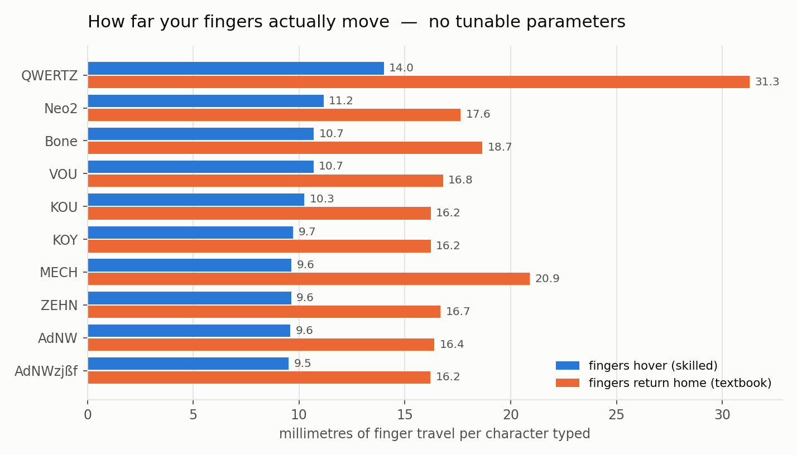
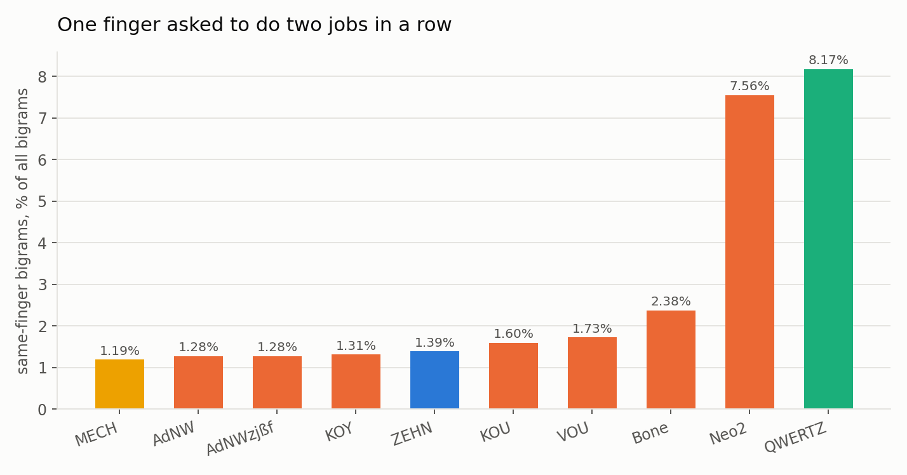
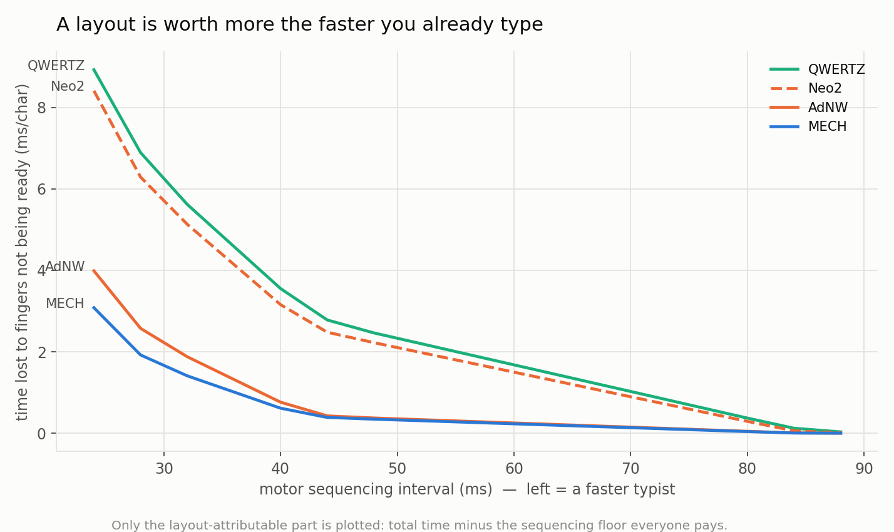
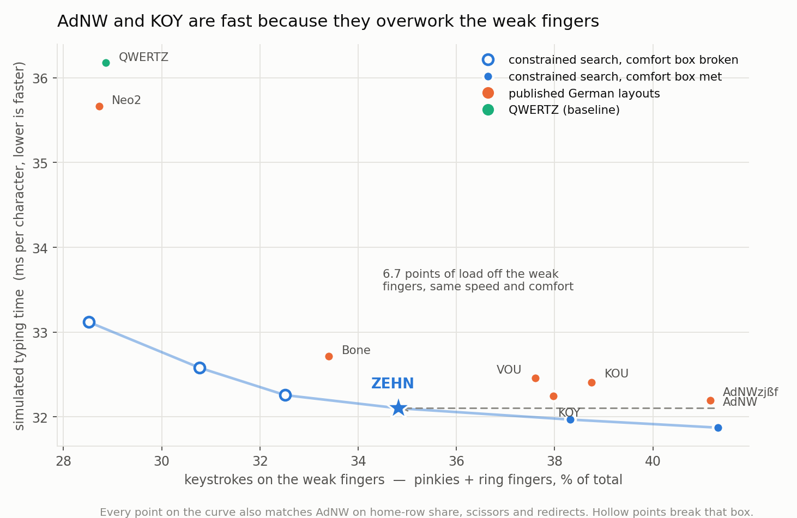
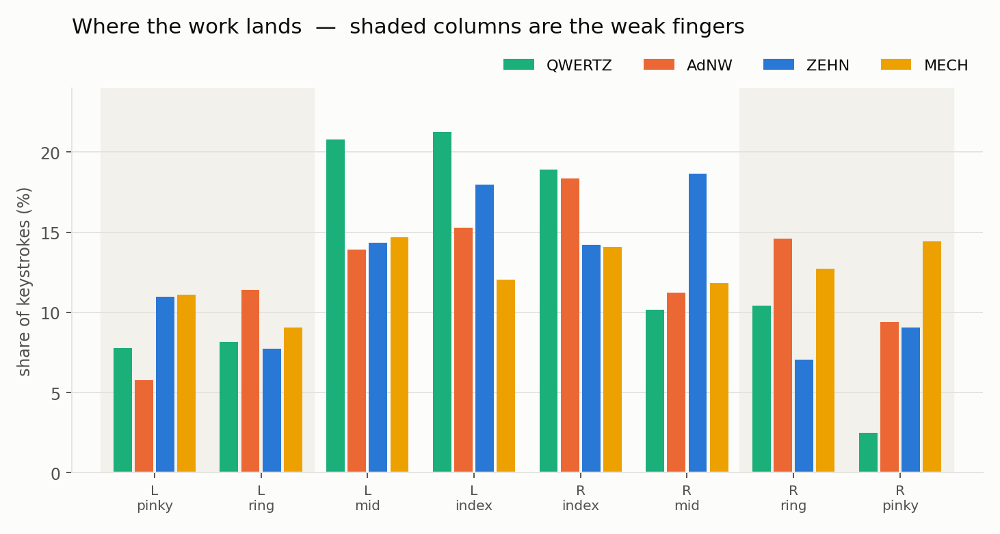
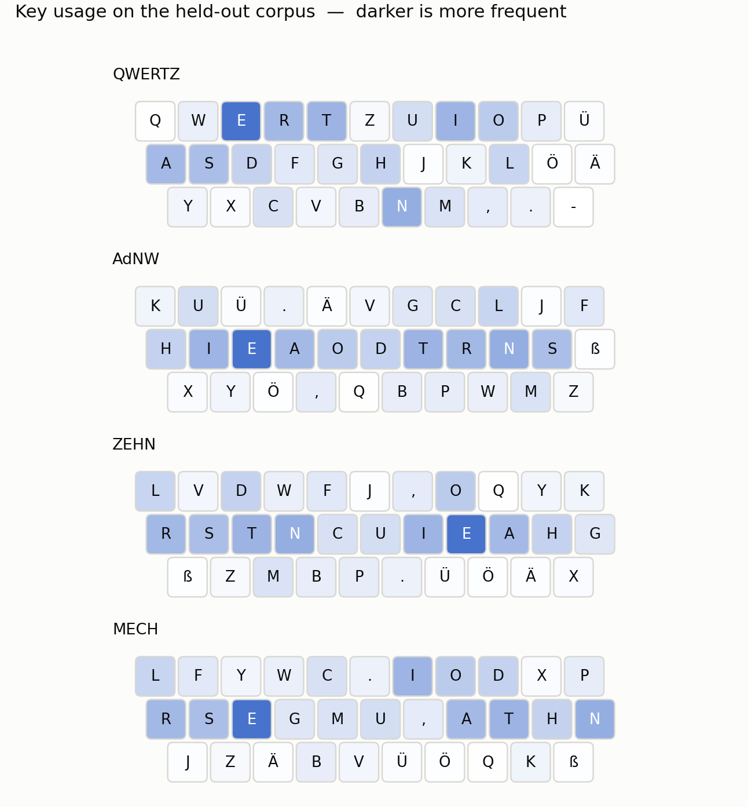

# A ten-finger system for the German/Austrian keyboard

**Short version:** the well-known German layouts (AdNW, KOY, Neo2) are genuinely much
better than QWERTZ — 8.1% of QWERTZ bigrams put one finger on two keys in a row, against
1.2% for AdNW, and QWERTZ moves your fingers 46% further per character. But the two best
of them buy their speed by loading **41% of all keystrokes onto the pinkies and ring
fingers**, against QWERTZ's 28%. That trade is not necessary. A constrained search finds a
layout that matches AdNW on speed, home-row share, scissors and redirects while carrying
**34.6%** on those weak fingers.

It is called **ZEHN**, and it is a 32-character string that loads into an existing driver:

```
   l  v  d  w  f     j  ,  o  q  y  k
    r  s  t  n  c     u  i  e  a  h  g
     ß  z  m  b  p     .  ü  ö  ä  x

   lvdwfj,oqykrstncuieahgßzmbp.üöäx
```

**Longer version, and the part that matters more:** for anyone who writes code, the letters
are the *small* half of the problem. Fixing the symbol layer is worth **−39%** on symbol
keystrokes, moving Backspace to a thumb is worth more than the entire letter layout, and
German's capitalisation makes Shift discipline worth about 4% of everything — none of
which requires learning a new alphabet.

---

## Contents

| | |
|---|---|
| [The problem with layout studies](#the-problem-with-layout-studies) | why most of these numbers are circular, and what was done about it |
| [Findings](#findings) | the eight results, with what each one rests on |
| [The layout](#the-layout) | ZEHN, and how to install it |
| [Honest limitations](#honest-limitations) | what this does not show |
| [docs/METHOD.md](docs/METHOD.md) | full methodology |
| [docs/INSTALL.md](docs/INSTALL.md) | how to actually run ZEHN on Windows |
| [docs/REPRODUCE.md](docs/REPRODUCE.md) | every command, and what would falsify the finding |
| [RESULTS.md](RESULTS.md) | all the tables |

---

## The problem with layout studies

Any optimiser will produce a layout that beats every existing layout **on the optimiser's
own scoring function**. That is a tautology, not a discovery, and most published layout
comparisons are exactly that.

This study started that way and got a useful lesson out of it. The first search used a
conventional weighted-effort model — pinky costs 1.75 of an index finger, a same-finger
bigram costs 4.0, a scissor 2.2 — and produced a layout scoring **4.7% better than the
best published layout**. Then the untuned measures came in:

| | its own objective | same-finger % | finger travel | independent time model |
|---|---|---|---|---|
| the new layout vs AdNW | **−4.7%** | 1.61 vs 1.17 — **worse** | +1.2% — **worse** | +0.1% — a tie |

It won on the thing it was optimised for and on nothing else. Those weights were my
opinion wearing a lab coat.

So the whole apparatus was rebuilt to report results at **three separate levels of
assumption**, and every finding below is labelled with the level it rests on.

**Level 0 — no tunable parameters at all.** Geometry and corpus counts. How far the
fingers actually move; how often one finger is asked to do two jobs in a row; how the work
is spread. Nothing here can be tuned.

**Level 1 — three physical constants, swept rather than chosen.** A simulator in which ten
fingers are independent actuators that move **concurrently**: while the right index types,
the left middle is already travelling. A keystroke is delayed only when the finger it needs
is still busy.

```
press[i] = max( press[i-1] + GAP,  free[finger] + travel_time(from, to) )
```

Everything the weighted models put in by hand falls out of this instead — same-finger
bigrams are slow because one actuator must do two jobs in series; alternating hands is fast
because the travel hides behind the other hand. Rather than pick values for the three
constants, the analysis **sweeps 36 combinations** and reports whether the ranking changes.

**Level 2 — the weighted model.** Kept for comparison, relied on for nothing.

The simulator's behaviour was also solved in closed form so it could be optimised against.
The closed form tracks the sequential simulator with **correlation 1.0000, identical
ranking, mean absolute error 0.147 ms/char**.

---

## Findings

### 1. QWERTZ is as bad as its reputation, and the German alternatives are as good as theirs
*(Level 0 — no parameters)*



Millimetres of finger travel per character typed, on held-out text, bracketed two ways
because how far a hand drifts back toward home is genuinely unknown. QWERTZ moves your
fingers **14.0 mm per character** if you hover and **31.4 mm** if you return home between
keys; AdNW needs 9.6 / 16.4.



Same-finger bigrams — one finger asked to do two jobs in a row — are **8.08%** on QWERTZ
and **1.21%** on AdNW, a factor of seven.

### 2. A layout is worth much more the faster you already type
*(Level 1 — swept)*



This is the finding that makes single-number claims about layouts meaningless. At a slow
sequencing rate the fingers always have time to arrive and the layout barely matters; at
speed, same-finger collisions become the binding constraint. Across the 36-point sweep,
ZEHN is between **0.0% and 16.8%** faster than QWERTZ, mean 5.0%.

Anyone quoting "layout X is N% faster" without saying how fast the typist is has hidden the
most important variable.

### 3. AdNW and KOY are fast because they overwork the weak fingers
*(Level 0 — no parameters)*

This is the observation the rest of the study is built on.

| layout | weak-finger load | same-finger % | simulated ms/char |
|---|---|---|---|
| QWERTZ | **28.5%** | 8.08 | 36.12 |
| Neo2 | 28.7% | 7.38 | 35.56 |
| Bone | 33.5% | 2.35 | 32.53 |
| KOY | 37.9% | 1.25 | 32.21 |
| AdNW | **41.3%** | 1.21 | 32.15 |

Weak fingers = both pinkies and both ring fingers. The German optimised layouts are ranked
almost perfectly by how much load they move onto them. That is not a coincidence: putting
letters on the pinky columns is *how* you get same-finger collisions down, because it
spreads the alphabet across more fingers.

### 4. That trade is not necessary
*(Level 1 — the decisive experiment)*



The question was made precise and falsifiable: **is there a layout that matches AdNW on
every awkwardness measure and on simulated time, while carrying far less weak-finger
load?**

The constraint box is set to **AdNW's own figures** — not to weights I chose — and the
weak-finger cap is tightened step by step. The search either finds a layout inside the box
or it does not:

| weak-finger cap | ms/char | weak % | home-row % | scissors % | redirects % | inside the box? |
|---|---|---|---|---|---|---|
| 41% | 31.772 | 40.8 | 60.7 | 0.08 | 3.44 | **yes** |
| 38% | 31.848 | 37.9 | 60.7 | 0.08 | 3.42 | **yes** |
| **35%** | **31.998** | **34.6** | **60.7** | **0.10** | **3.44** | **yes** |
| 32% | 32.159 | 31.9 | 60.7 | 0.08 | 3.35 | no — too slow |
| 30% | 32.501 | 30.1 | 60.7 | 0.12 | 3.31 | no |
| 28% | 32.957 | 28.2 | 60.7 | 0.12 | 3.39 | no |

So the answer is yes down to about 35%, and no below 32%. That bound is a real one, not an
artefact of where I stopped looking.

Confirmed on held-out text:

| | ms/char | weak % | home-row % | scissors % | redirects % |
|---|---|---|---|---|---|
| **ZEHN** | **32.066** | **34.6** | 60.1 | 0.11 | 3.59 |
| AdNW | 32.149 | 41.3 | 60.1 | 0.10 | 3.67 |



**A caveat visible in that figure.** The aggregate improves, but not every finger does.
ZEHN puts *more* on the left pinky than AdNW (10.7% vs 6.0%) and much less on the right
ring (6.9% vs 14.6%). If your problem is specifically a left pinky, this is not the layout
for you — take the 38% or 41% row of the frontier table instead, or re-run the search with
a per-finger cap rather than an aggregate one. The constraint used here was on the sum of
the four weak fingers, and a sum can improve while a component worsens.

### 5. The result holds across every workload tested
*(Level 1 — held-out text only)*

| workload | ZEHN weak % | AdNW weak % | gap | ZEHN ms/char | AdNW ms/char |
|---|---|---|---|---|---|
| 45% German / 30% English / 25% code | 34.6 | 41.3 | **−6.7** | 32.066 | 32.149 |
| pure German | 34.7 | 43.2 | **−8.5** | 31.876 | 31.969 |
| pure English | 35.2 | 39.9 | **−4.7** | 32.075 | 32.050 |
| pure code | 33.4 | 39.5 | **−6.1** | 32.399 | 32.591 |
| 70% German | 34.7 | 42.2 | **−7.5** | 31.968 | 32.048 |
| equal thirds | 34.5 | 40.9 | **−6.4** | 32.114 | 32.201 |

Across the 36-point physical parameter sweep, ZEHN minus AdNW ranges from **−0.175 to
+0.051 ms/char**, mean −0.011. That is a wash, and stating it as a wash is the honest
claim: **ZEHN buys 5–8 points of weak-finger relief at no measurable speed cost.** It is
not a speed improvement and is not offered as one.

### 6. If you write code, the symbol layer matters more than the letters
*(Level 2 — weighted, but the gap is far larger than the weights)*

On a German keyboard the characters a programmer types constantly are the worst-placed
characters on the board. Measured over **1,526,672 symbol keystrokes** from the Python
standard library:

| char | share of symbol keystrokes | QWERTZ | cost | Neo layer 3 | cost |
|---|---|---|---|---|---|
| `_` | 11.7% | Shift + `-` | 4.63 | Mod3 + `w` | 3.27 |
| `'` | 9.9% | Shift + `#` | 5.03 | Mod3 + `.` | 3.53 |
| `"` | 9.1% | Shift + `2` | 5.04 | Mod3 + `,` | 3.05 |
| `)` | 8.1% | Shift + `9` | 5.04 | Mod3 + `k` | 1.95 |
| `(` | 8.1% | Shift + `8` | 4.38 | Mod3 + `j` | 1.90 |
| `=` | 5.2% | Shift + `0` | 5.91 | Mod3 + `o` | 3.27 |
| `\` | 2.1% | **AltGr + `ß`** | 6.59 | Mod3 + `a` | 2.65 |
| `}` | 0.4% | **AltGr + `0`** | 6.26 | Mod3 + `f` | 1.90 |
| | **mean** | | **3.77** | | **2.29** |

**−39.2%**, and it requires learning no new letter positions at all. `(` and `)` land on
the right index and middle home keys instead of Shift+8 and Shift+9.

If you take one thing from this repository, take this one.

### 7. German makes Shift discipline worth about 4% of everything
*(Level 0 for the counts, Level 2 for the cost)*

German capitalises every noun. Measured on the corpora:

| corpus | capitals as % of letters |
|---|---|
| German (modern, Wikipedia) | **8.82%** |
| German (19th-century, Gutenberg) | 5.18% |
| English | 2.59% |

A German typist shifts **3.4× as often as an English one**. Using the Shift on the same
hand as the letter costs **+79% per capital on QWERTZ** and **+120% on AdNW** versus using
the opposite hand. At modern German capitalisation rates that is roughly **4% of total
typing effort**, available for free, without changing anything on the keyboard.

### 8. Backspace is worth more than the entire letter layout
*(Level 0 geometry, external frequency)*

Backspace sits **57 mm** from the right pinky's home key — the longest reach on the board —
and it is one of the three most-pressed keys on any keyboard. A thumb key costs almost
nothing.

| backspace as % of keystrokes | effort saved by moving it to a thumb |
|---|---|
| 2.0% | 4.4% |
| 4.0% | 8.8% |
| **5.9%** (trained typists) | **13.0%** |
| **6.5%** (untrained) | **14.3%** |
| 8.0% | 17.6% |

The 5.9% / 6.5% figures are from Dhakal et al., *Observations on Typing from 136 Million
Keystrokes* (CHI 2018) — the one number in this study taken from outside. At those rates,
remapping one key beats the entire difference between ZEHN and AdNW.

### Also measured, and small: the ISO angle mod

Shifting the left bottom row one key left onto the `<` key straightens the hand and costs
nothing to learn. It is worth **−0.5% on QWERTZ** and **−0.1% on the optimised layouts** —
real, free, and much smaller than its reputation. The reason is visible in the geometry: it
mainly rescues the `b` key at 34.3 mm, and a good layout already avoids putting a frequent
letter there.

### And: you get most of the benefit from moving eight keys

*(Level 1, unconstrained on finger load — see the caveat)*

| keys moved from QWERTZ | ms/char | vs QWERTZ | share of a full relearn |
|---|---|---|---|
| 2 | 34.60 | −4.2% | 38% |
| 4 | 33.71 | −6.7% | 59% |
| 6 | 32.77 | −9.3% | 83% |
| **8** | **32.25** | **−10.7%** | **95%** |
| 12 | 31.90 | −11.7% | 104% |
| 30 | 31.60 | −12.5% | 111% |

Caveat that matters: these partial layouts were optimised for time only, and they drift up
to 45–47% weak-finger load — they reproduce exactly the trade that finding 3 criticises. A
partial move done properly would need the same constraint box.

---

## The layout

```
   l  v  d  w  f     j  ,  o  q  y  k
    r  s  t  n  c     u  i  e  a  h  g
     ß  z  m  b  p     .  ü  ö  ä  x
```



### Installing it

No driver needs writing. ZEHN is expressed in exactly the format
[neo2-llkh](https://github.com/MaxGyver83/neo2-llkh) accepts. Put this `settings.ini` next
to `neo-llkh.exe`:

```ini
[Settings]
customLayout=lvdwfj,oqykrstncuieahgßzmbp.üöäx
symmetricalLevel3Modifiers=1
qwertzForShortcuts=1
capsLockEnabled=0
```

| setting | why |
|---|---|
| `symmetricalLevel3Modifiers=1` | Mod3 on **both** CapsLock and `ä`, so every symbol is reachable with the opposite hand. This is what makes finding 6 work. |
| `qwertzForShortcuts=1` | Ctrl+Z/X/C/V/A/S stay on their QWERTZ keys. This removes any reason to constrain the layout for shortcut compatibility — an earlier version of this study wasted a constrained search on that problem before finding this flag. |
| `capsLockEnabled=0` | CapsLock becomes Mod3. You will not miss it. |

### The symbol layer

Hold Mod3 (CapsLock or `ä`) — use the hand *opposite* the symbol:

```
   …  _  [  ]  ^     !  <  >  =  &  ſ
    \  /  {  }  *     ?  (  )  -  :  @
     #  $  |  ~  `     +  %  "  '  ;
```

### If you are not going to relearn 32 keys

Entirely defensible. In order of benefit per hour invested:

1. **Neo layer 3 on QWERTZ.** Run neo2-llkh with `layout=qwertz` and
   `symmetricalLevel3Modifiers=1`. Letters do not move; you get finding 6 for free.
2. **Move Backspace to a thumb key.** One key, finding 8.
3. **Use the opposite-hand Shift, always.** Zero keys, finding 7, and it matters more in
   German than anywhere else.
4. **AdNW or KOY** if you do want a new alphabet — they are within noise of ZEHN on
   everything except weak-finger load, and they have a community, tutorials and a decade of
   real use behind them. ZEHN has none of that.

---

## Honest limitations

- **No human ever typed on ZEHN.** Every number here is a model. The models are calibrated
  to reproduce the known ordering of existing layouts before being used to design one, and
  the parameter-free measures cannot be tuned — but a simulation is not an experiment.
- **The weak-finger claim rests on a physiological premise the study cannot test.** That
  pinkies and ring fingers should carry less work than index and middle fingers is
  standard ergonomic advice, not something geometry can prove. If that premise is wrong,
  AdNW is simply better and this whole result dissolves. It is stated as a premise for
  exactly that reason.
- **The speed difference is a wash and is reported as one.** ZEHN is not faster than AdNW.
- **`-` is excluded from scoring** because QWERTZ has it in the main block and the Neo
  family has it on layer 3. This mildly favours the Neo family.
- **The Wikipedia portion of the test corpus is a random sample** and will differ if you
  re-run the fetch. The Gutenberg portion is byte-reproducible by ID.
- **Switching costs are real and are not modelled.** Three to six weeks at reduced speed,
  and every other keyboard you touch becomes hostile.

## Reproducing

Everything is in [`src/`](src/); see [docs/REPRODUCE.md](docs/REPRODUCE.md) for the exact
commands, the corpus manifest, and what result would falsify the main finding. Python 3.12,
numpy, matplotlib, about 45 minutes on one core.

```bash
cd src
python fetch_corpus.py && python fetch_wiki.py
python verify.py          # must print ALL CHECKS PASSED before anything else means anything
python simfast.py         # must print correlation 1.0000
python efficiency.py dev-at
python final_search.py dev-at 5
python robustness.py
```

## Licence

MIT. The corpora are not redistributed: Project Gutenberg texts are fetched by ID, and the
Wikipedia sample is CC BY-SA and fetched from the API.
